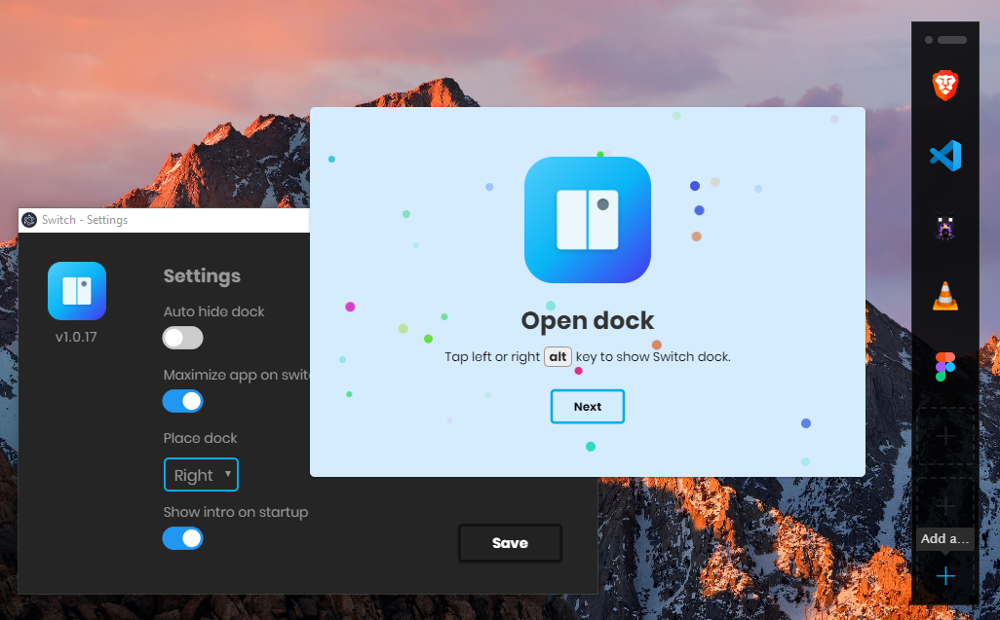

[](https://travis-ci.org/ahkohd/switch-desktop) [](https://ci.appveyor.com/project/ahkohd/switch-desktop)

Keyboard-driven commands to navigate your apps faster. Available for 🪟 Windows & 🍏 macOS

> 🆕 🥳 **Hurray!** We are happy to announce that Switch is now available for **macOS**. [**Download now 👌**](https://get-switch.app)

> ℹ️ **Switch 2** for Windows is around the corner. Have a feature in mind? [Let us know! 👈](https://github.com/ahkohd/switch-desktop/discussions)

# Features

- Switch fast between apps.
- Favourite apps loadout.
- Convenience of use by both left and right handed users with the use of left/right <kbd>alt</kbd> or <kbd>⌘</kbd> + <kbd>⌥</kbd> on macOS.

> **[Download Switch now 🪟 🍏](https://get-switch.app)**

# Screenshot



# Components

Switch as two main components.

- [Switch desktop](https://github.com/ahkohd/switch-desktop) Serves as the UI, provides the dock and tray menu.
- [Switch service](https://github.com/ahkohd/switch) Does the actual window switching magic.

# Contributing

If you have found any bugs or just want to see some new features in Switch, feel free to open an issue. I'm open to any suggestions and bug reports would be really helpful. Switch is under development and some bugs may occur. Also, please don't hesitate to open a pull request.

# Running

Before running Switch in development mode, please ensure you have Node.js installed on your machine.

Clone this repo, and cd into it, Then:

```bash
$npm i
$npm run get-ss-prebuild
$npm run dev
```

# License

[Read LICENSE.md](./LICENSE.md)
